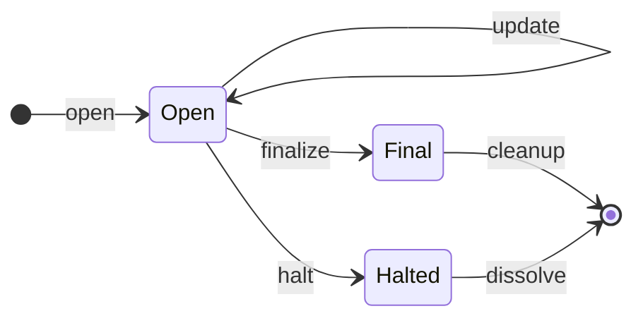
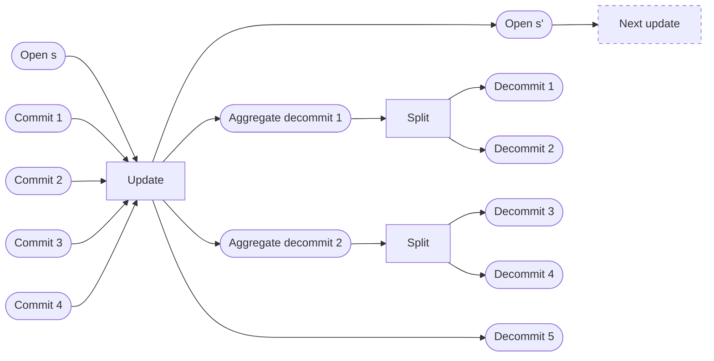
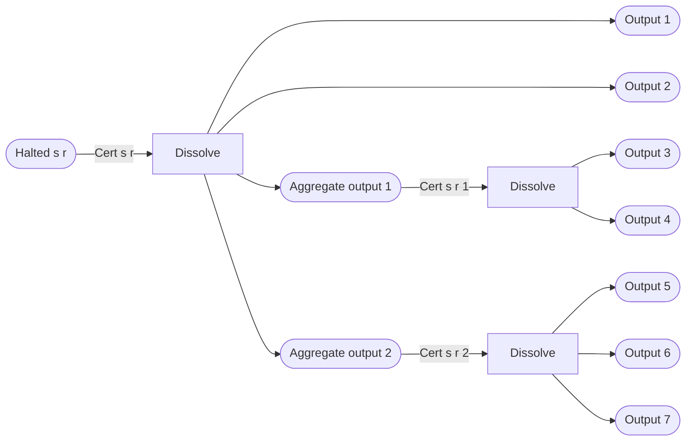

# Hydrozoa: Lightweight and scalable Hydra Heads

<i>By George Flerovsky</i>

This paper introduces <i>Hydrozoa</i> — an adaptation of the [Coordinated Hydra Head protocol](https://github.com/ch1bo/hydra-spec) with more lightweight and scalable Hydra Heads. It introduces cheap and deterministic state update transactions as the default way to commit utxos to and decommit utxos from the Hydra Head. A similarly cheap finalization procedure can be used to stop operating the head if consensus can be maintained throughout its life. The halt and dissolve procedures (analogous to close and fanout in the Coordinated Hydra Head) are more expensive and should only be used if L2 consensus breaks down.

The notation used throughout this document is similar to the notation of the Coordinated Hydra Head protocol spec and other Hydra papers.

## Introduction

The [Hydra Head protocol](https://hydra.family/head-protocol/) allows a group of participants to temporarily transfer control over a subset of utxos from the Cardano mainnet (L1) ledger to a private unanimous consensus protocol (L2) run by the participants, instead of the Ouroboros consensus protocol running on the whole Cardano mainnet. While the Hydra Head controls these utxos, transactions involving them are quickly broadcast among the participants and then confirmed with immediate finality as soon as all participants sign a corresponding snapshot. The utxos resulting from the L2 transactions can be brought back under L1 control by finalizing an L2 snapshot (via Close/Contest transactions) and then fanning them out on L1 from the state utxo.

The protocol was developed before Plutus was added to mainnet, effective design patterns emerged for building dApps in the eUTXO model, and the Vasil enhancements enabled a completely different approach to dApp design on Cardano. It can be improved by applying the lessons learned over the past year.

## Design

The main design ideas of Hydrozoa are:

1. Eliminate the initialization phase — open the Hydra Head immediately with an empty L2 active utxo set.
1. Commit utxos on L1 to the head simply by sending them to a native script address controlled by the participants' keys.
1. Transact on L2 in the same way as before, using Cardano ledger rules to apply transactions to the L2 active utxo set.
1. Decommit utxos via a new L2 request to remove certain utxos from the L2 active utxo set, validated like an input-only transaction via modified Cardano ledger rules.
1. While the head is open, periodically collect commits and release decommits on L1, updating the major version in the L1 head state. Semantic versioning is used because these updates are backwards incompatible with previous snapshots — updates change the balance of funds at the head state utxo.
1. If participants can maintain L2 consensus, finalize the head and release its L2 active utxo set on L1 just as cheaply and efficiently as if all utxos decommitted.
1. If L2 consensus breaks down, halt the head and dissolve its remaining funds to produce outputs corresponding to the L2 active utxo set of the snapshot with which it was halted. Dissolution is specified and authorized via multi-signed certificates instead of multi-signed transactions.
1. Spin off the contestation mechanism so that it can only affect the head state when the contestation deadline elapses or all participants have exercised their right to contest.
1. Updates should be used during normal operation to commit and decommit utxos, finalization should be used if the participants want to stop operating the head, and the contestation mechanism should only be used to halt the head if consensus breaks down.

The L1 component of the Hydra Head protocol becomes simpler, cheaper, and more scalable. In exchange, the L2 component is somewhat more complicated.

### Prepare

A group of participants $\\mathcal{P} = \\{p\_i\\}$ decides to open a Hydra Head. In preparation, they must:

- Establish pairwise communication channels between each other.
- Generate the participant keys $K = \\{(k\_{i}^\\textrm{ver}, k\_i^\\textrm{sig})\\}$, with each signing key $k\_i^\\textrm{sig}$ kept privately by its respective participant and each verification key shared with all participants.
- Agree on the timeout period for pending commits $T\_P$.
- Agree on the contestation period $T\_C$.

Unlike the existing Hydra Head protocol, there is no need to generate a separate set of L2 participant keys, because the initialization phase has been eliminated. The participant keys $K$ are used in both the L1 and L2 parts of the Hydra Head protocol.

### Open the head

The participants submit a multi-signed L1 <i>open</i> transaction $\\textrm{tx}\_\\textrm{open}(\\pi)$ that must:

- Spend a seed input utxo $\\phi\_\\textrm{seed}$.
- Mint a state token $\\textrm{ST}$.
- Mint a contestation thread token $\\textrm{CT}$.
- Produce the head state utxo at the unparametrized validator $\\nu\_\\textrm{head}$.
- Produce the contestation thread utxo at the unparametrized validator $\\nu\_\\textrm{contest}$.

The head state utxo is uniquely identified by the state token $\\textrm{ST}$ it holds, which is minted by an unparametrized minting policy $\\mu\_\\textrm{head}$ that sets its token name to the hash of the L1 protocol parameters.

$$
\\begin{aligned}
\\exists \\{ \\mu\_\\textrm{head} &\\mapsto \\pi \\mapsto 1 \\} \\\\
\\textrm{ST} &= (\\mu\_\\textrm{head}, \\pi) \\\\
\\pi &= \\textrm{hash}(\\textrm{params}) \\\\
\\textrm{params} &= (K, T\_C, T\_P, \\phi\_\\textrm{seed})
\\end{aligned}
$$

The datum of the state utxo contains the immutable $\\textrm{params}$ and the mutable $\\textrm{state}$.

$$
\\delta\_\\textrm{head} = (\\textrm{params}, \\textrm{state})
$$

The state of the Hydra Head is either open, halted, or final:

$$
\\begin{aligned}
\\textrm{state} &=
  \\textrm{Open} \\;s \\\\ &\\;\\;|\\;\\;
  \\textrm{Final} \\\\ &\\;\\;|\\;\\;
  \\textrm{Halted} \\;s \\;r \\\\ \\\\
s &\\in \\mathbb{N}
\\end{aligned}
$$

The state is initialized as $(\\textrm{Open} \\; 0)$ when the head is opened. The open state tracks only the [major version](#create-an-l2-snapshot) $s$ of some snapshot, while the halted state also tracks a minor version $r$ of some snapshot. The final state does not track any version number.

A head can transition out of the open state in two ways:

- The participants can unanimously agree to [<i>finalize</i> the head](#finalize-the-head).
- One of the participants can unilaterally trigger the contestation mechanism, in order to [<i>halt</i> the head](#halt-the-head).

<b>Figure 1:</b> State diagram for the Hydra Head on L1.

### Commit to the head

The Hydra Head opens with an empty L2 active utxo set. To populate it, utxos must be committed to the head on L1.

Suppose that one of that participants wants a utxo $\\omicron^\\textrm{L2}\_\\textrm{commit}$ to appear in the L2 utxo set at a (pubkey or script) address $\\alpha^\\textrm{L2}\_\\textrm{commit}$ with datum $\\delta^\\textrm{L2}\_\\textrm{commit}$ and value $\\textrm{val}^\\textrm{L2}\_\\textrm{commit}$.

$$
\\omicron^\\textrm{L2}\_\\textrm{commit} =
  \\left(
    \\textrm{val}^\\textrm{L2}\_\\textrm{commit},
    \\alpha^\\textrm{L2}\_\\textrm{commit},
    \\delta^\\textrm{L2}\_\\textrm{commit}
  \\right)
$$

The participant should prepare (but neither sign nor submit) an L1 <i>commit</i> transaction $\\textrm{tx}\_\\textrm{commit}$ that produces the output $\\omicron^\\textrm{L1}\_\\textrm{commit}$ (with output reference $\\phi^\\textrm{L1}\_\\textrm{commit}$) at the participants' native script address $\\zeta^K$:

$$
\\begin{aligned}
\\omicron^\\textrm{L1}\_\\textrm{commit} &=
  \\left(
    \\textrm{val}^\\textrm{L2}\_\\textrm{commit},
    \\zeta^K,
    \\delta^\\textrm{L1}\_\\textrm{commit}
  \\right) \\\\
\\delta^\\textrm{L1}\_\\textrm{commit} & =
  \\left(
    \\alpha^\\textrm{L2}\_\\textrm{commit},
    \\delta^\\textrm{L2}\_\\textrm{commit}
  \\right)
\\end{aligned}
$$

The native script $\\zeta^K$ allows utxos at its address to be spent only by transactions that have valid signatures for all the verification keys in $K$.

Before signing or submitting $\\textrm{tx}\_\\textrm{commit}$, the participant should request <i>assurance</i> on L2 from the other participants that the pending commit $\\phi^\\textrm{L1}\_\\textrm{commit}$ would be recoverable at a future time $t\_\\textrm{assure}$ (at least $T\_P$ seconds after the request is made), if the participant submits the commit transaction but no update transaction collects it into the head state. This prevents the commit from being stranded at $\\zeta^K$ by participant inaction.

The participants provide this assurance by multi-signing an L1 <i>assurance</i> transaction $\\textrm{tx}\_\\textrm{assure}$ that spends $\\phi^\\textrm{L1}\_\\textrm{commit}$ to produce $\\omicron^\\textrm{L2}\_\\textrm{commit}$, on or after time $t\_\\textrm{assure}$. This transaction should be included in a future snapshot and its signatures are gathered via the snapshot confirmation process.

When the participant obtains this multi-signed assurance transaction $\\textrm{tx}\_\\textrm{assure}$ from a confirmed snapshot, he should sign and submit the commit transaction $\\textrm{tx}\_\\textrm{commit}$.

### Transact on L2

Any participant may submit a new transaction on L2 while the head is open. The transaction is validated according to the Cardano ledger rules, and the effect of a valid L2 transaction is to remove its inputs and add its outputs to the L2 active utxo set.

Each participant caches the received L2 transaction requests, without validating them, until they are needed to create or verify a snapshot.

### Decommit on L2

Any participant may submit a decommit request on L2 while the head is open. The decommit request must include a notional transaction for the purposes of validating the request. The transaction must:

- Spend any number of inputs.
- Reference any number of reference inputs.
- Produce no outputs.
- Mint no tokens and burn no tokens.
- Pay no fees.
- Make no reward account withdrawals.
- Contain no metadata, certificates, or update proposals.

The decommit request is valid if both of the following are true:

- When applying the [UTXOW rules](https://github.com/input-output-hk/cardano-ledger/blob/master/eras/babbage/impl/src/Cardano/Ledger/Babbage/Rules/Utxow.hs), no UTXOW predicate failures are thrown. ([UTXO](https://github.com/input-output-hk/cardano-ledger/blob/master/eras/babbage/impl/src/Cardano/Ledger/Babbage/Rules/Utxo.hs) predicate failures are to be expected because the transaction is unbalanced)
- When applying the [UTXOS rules](https://github.com/input-output-hk/cardano-ledger/blob/master/eras/babbage/impl/src/Cardano/Ledger/Babbage/Rules/Utxos.hs), no predicate failures are thrown.

In other words, utxos at pubkey and phase-1 script addresses can be decommitted with consent from their owners, while utxos at phase-2 script addresses can be decommitted if their validators allow them to be spent in the decommit request's unbalanced notional transaction (perhaps with a redeemer specialized for this purpose).

The effect of a valid decommit request is to remove its notional transaction's inputs (but not the reference inputs) from the L2 active utxo set and add them to the L2 decommit set.

Each participant caches the received L2 decommit requests, without validating them, until they are needed to create or verify a snapshot.

### Create an L2 snapshot

Participants take turns in a round-robin fashion to create the sequence of L2 snapshots. When a snapshot leader receives a transaction request and there is no snapshot currently accumulating signatures to be confirmed, then it is time for the snapshot leader to create and broadcast the next snapshot.

Snapshots are versioned semantically. Let the previous snapshot be $\\Upsilon(s,r)$ and the next snapshot be $\\Upsilon(s',r')$. If $\\Upsilon(s',r')$ collects any commits or releases any decommits on L1 via an [<i>update</i> transaction](#update-the-head), then it is <i>major</i> (with its major version $s'$ incremented and minor version $r'$ set to zero); otherwise, it is <i>minor</i> (with its minor version $r'$ incremented).

$$
(s', r') =
\\begin{cases}
(s + 1, 0) \\qquad \\exists \\; \\textrm{tx}\_\\textrm{update}(s') \\\\
(s, r + 1) \\qquad \\textrm{otherwise}
\\end{cases}
$$

A snapshot $\\Upsilon(s',r')$ must contain:

- The snapshot version $(s',r')$.
- Hashes of the L2 [transaction](#transact-on-l2) and [decommit](#decommit-on-l2) requests $\\mathcal{R}^\\textrm{L2}(s',r')$ that the snapshot leader has observed since the last snapshot $\\Upsilon(s,r)$, sequenced in order of arrival. If the snapshot is minor, then $\\mathcal{R}^\\textrm{L2}(s',r')$ does not contain decommit requests.
- The [assurance transactions](#commit-to-the-head) $\\mathcal{T}\_\\textrm{assure}(s', r')$ for pending commits requested since the previous snapshot.
- If the snapshot is major, the [new L1 commits](#update-the-head) $\\Phi^\\textrm{L1}\_\\textrm{commit}(s')$ and corresponding new L2 commits $\\Phi^\\textrm{L2}\_\\textrm{commit}(s')$ introduced into the head by the update transaction.

Update transactions cause the major version to be incremented because they cause backwards-incompatible changes to the head state:

- When a new commit is collected, previous snapshots' conditional dissolution plans are invalidated because the head state utxo now contains more funds than they expect to release from the head.
- When a decommit is released from the head, the previous plans are invalidated because the head state utxo now contains fewer funds than they expect to release from the head.

### Update the head

A snapshot leader must create a major snapshot $\\Upsilon(s',0)$ if, by the time that the previous snapshot $\\Upsilon(s,r)$ is confirmed, the snapshot leader has observed any L2 decommit requests in $\\mathcal{R}^\\textrm{L2}(s',0)$ or any eligible L1 commits $\\Phi^\\textrm{L1}\_\\textrm{eligible}(s', 0)$.

The snapshot leader applies the L2 transaction and decommit requests $\\mathcal{R}^\\textrm{L2}(s',0)$ to the previous snapshot's L2 ledger state $\\mathcal{L}^\\textrm{L2}(s,r)$ to produce the ledger state $\\mathcal{L}^\\textrm{L2}(s',0)$. The snapshot leader then uses the deterministic algorithm $\\mathcal{Algo}\_\\textrm{settle}$ to:

1. Select the largest prefix $\\Phi^\\textrm{L1}\_\\textrm{commit}(s') \\subseteq \\Phi^\\textrm{L1}\_\\textrm{eligible}(s', 0)$ of commits that can be collected in the snapshot $\\Upsilon(s',0)$, leaving the rest to be collected in future snapshots.
1. Derive a non-empty tree of L1 settlement transactions $\\mathcal{T}\_\\textrm{settle}(s')$ that together update the open head state, collect the selected L1 commits, and release outputs corresponding to the L2 decommit set in $\\mathcal{L}^\\textrm{L2}(s',0)$.

The <i>update</i> transaction $\\textrm{tx}\_\\textrm{update}(s')$ is at the root of this tree and must:

- Spend the previous head state utxo $\\phi\_\\textrm{open}(s)$ with state $(\\textrm{Open} \\;s)$.
- Produce the updated head state utxo $\\phi\_\\textrm{open}(s')$ with state $(\\textrm{Open} \\; s')$.
- Do at least one of the following:
  - Spend one or more eligible commit utxos.
  - Produce one or more decommit utxos and/or aggregate decommit utxos.

If $\\textrm{tx}\_\\textrm{update}(s')$ produces any aggregate decommit utxos, then each of its descendants in the tree $\\mathcal{T}\_\\textrm{settle}(s')$ splits a parent aggregate decommit into granular decommits and/or further aggregate decommits, such that the collective outputs of $\\mathcal{T}\_\\textrm{settle}(s')$ are equivalent to the required L2 decommits for the snapshot. Otherwise, $\\mathcal{T}\_\\textrm{settle}(s')$ is a singleton tree.

All aggregate decommits must be sent to the participants' native script address $\\zeta^K$, with their datums set to the bytestring $\\textrm{AggDecommit}$. They must be ignored by participants for the purposes of identifying eligible commits and none of them can remain unspent after the settlement transactions are executed.

If a major snapshot is confirmed, then its update transaction remains valid regardless of what may happen in any future snapshots. Furthermore, each update transaction $\\textrm{tx}\_\\textrm{update}(s')$ depends on the head state output of its predecessor update transaction $\\textrm{tx}\_\\textrm{update}(s)$, which means that the update transactions can only be executed in order of major snapshot versions. Moreover, the [halting mechanism](#halt-the-head) for the head ensures that all update transactions for confirmed snapshots must be executed before the head can be dissolved.

The update transaction of a confirmed snapshot can only be invalidated if it fails to spend a commit utxo, which can occur in two ways:

1. The commit utxo is never created because an alternative blockchain fork prevails and replaces the commit transaction with a conflicting transaction.
1. The commit utxo is spent by its assurance transaction.

To minimize the chance of invalidation, the update transaction must only collect commits with sufficient block depth and these commits must be spendable with enough time remaining before their assurance transactions become valid. These are the "eligible" commits for $\\Upsilon(s',0)$.

<b>Figure 2:</b> Example transaction flow for a major snapshot's update that collects four commits and releases five decommits via two aggregate decommits. Utxos are represented by rounded nodes, while transactions are represented by square nodes.

### Dissolve the head

The snapshot certificate $\\xi(s,r)$ of a snapshot $\\Upsilon(s,r)$ consists of the snapshot's major and minor versions, a hash $\\eta(s,r)$, and the last major snapshot's open head state utxo $\\phi\_\\textrm{open}(s)$. If $\\Upsilon(s,r)$ is major, then $\\phi\_\\textrm{open}(s)$ is produced by its own update transaction.

$$
\\xi(s,r) = \\left( s, r, \\eta(s, r), \\phi\_\\textrm{open}(s) \\right)
$$

The snapshot's L2 ledger state $\\mathcal{L}^\\textrm{L2}(s,r)$ is the result of applying the snapshot leader's observed L2 requests $\\mathcal{R}^\\textrm{L2}(s,r)$ to the previous snapshot's ledger state. The deterministic algorithm $\\mathcal{Algo}\_\\textrm{dissolve-cert}$ derives the tree of dissolution certificates $\\Xi\_\\textrm{dissolve}(s,r)$ from the L2 active utxo set in $\\mathcal{L}^\\textrm{L2}(s,r)$, with the snapshot certificate $\\xi(s,r)$ at the root of this tree.

Suppose that the halted head state utxo $\\phi\_\\textrm{halted}(s,r)$ exists with the state $(\\textrm{Halted} \\; s \\; r)$. The deterministic algorithm $\\mathcal{Algo}\_\\textrm{dissolve-tx}$ derives a tree of transactions $\\mathcal{T}\_\\textrm{dissolve}(s,r)$ from the certificates $\\Xi\_\\textrm{dissolve}(s,r)$ and the halted head state utxo $\\phi\_\\textrm{halted}(s,r)$. These transactions collectively spend $\\phi\_\\textrm{halted}(s,r)$ and produce outputs equivalent to the L2 active utxo set of the snapshot $\\Upsilon(s,r)$, using the corresponding certificates in $\\Xi\_\\textrm{dissolve}(s,r)$ for authorization.

The root dissolution transaction $\\textrm{tx}\_\\textrm{dissolve}(s,r)$ must:

- Spend the halted head state utxo $\\phi\_\\textrm{halted}(s,r)$ with state $(\\textrm{Halted} \\; s \\; r)$, using the multi-signed snapshot certificate $\\xi(s,r)$ in the redeemer.
- Do at least one of the following:
  - Produce one or more granular outputs.
  - Produce one or more aggregate outputs. Each aggregate output $\\phi\_\\textrm{agg}(s,r,j)$ is at the unparametrized validator $\\nu\_\\textrm{dissolve}$ with datum $(s, r, j)$.
- Verify that the granular and aggregate outputs hash to $\\eta(s,r)$.

If $\\textrm{tx}\_\\textrm{dissolve}(s,r)$ produces any aggregate outputs, then each of its descendants in $\\mathcal{T}\_\\textrm{dissolve}(s,r)$ splits a parent aggregate output $\\phi\_\\textrm{agg}(s,r,j)$ into granular outputs and/or further aggregate outputs, using the corresponding multi-signed certificate $\\xi(s,r,j) \\in \\Xi(s,r)$ for authorization in the redeemer. Otherwise, $\\mathcal{T}\_\\textrm{dissolve}(s,r)$ is a singleton tree.

$$
\\xi(s,r,j) = (s, r, j, \\eta(s,r,j))
$$

The snapshot certificate references $\\phi\_\\textrm{open}(s)$ to ensure that the [halting mechanism](#halt-the-head) can only halt the head with the state $(\\textrm{Halted} \\; s \\; r)$.

<b>Figure 3:</b> Example transaction flow for the dissolution of a hydra head into six granular outputs via two aggregate outputs.

### Verify a snapshot

Suppose that the latest confirmed snapshot is $\\Upsilon(s,r)$ and the snapshot leader broadcasts the next snapshot $\\Upsilon(s',r')$ to all the other participants. Each participant must verify this snapshot as follows before confirming it.

First, the participant checks the snapshot validity preconditions:

1. The current L1 head state is not halted or final.
1. The snapshot was received from the expected snapshot leader.
1. The snapshot version numbers are [correct](#create-an-l2-snapshot).

The participant waits until he has observed all of the L2 transaction and decommit requests $\\mathcal{R}^\\textrm{L2}(s',r')$. If the snapshot is major, the participant also waits until he observes all of the commit utxos $\\Phi^\\textrm{L1}\_\\textrm{commit}(s')$ on L1 and considers them [eligible for collection](#update-the-head).

The participant applies the L2 requests  $\\mathcal{R}^\\textrm{L2}(s',r')$ to the previous snapshot's L2 ledger state $\\mathcal{L}^\\textrm{L2}(s,r)$, obtaining the L2 ledger state $\\mathcal{L}^\\textrm{L2}(s',r')$.

The participant simulates an L1 ledger state $\\mathcal{L}^\\textrm{Sim}\_\\textrm{prev}(s')$ that contains the open head state $\\phi\_\\textrm{open}(s)$ from the previous major snapshot and the commit utxos $\\Phi^\\textrm{L1}\_\\textrm{commit}(s')$ from the snapshot being verified.

If the snapshot is major, the participant applies the settlement transactions $\\mathcal{T}\_\\textrm{settle}(s')$ in breadth-first order to that ledger state $\\mathcal{L}^\\textrm{Sim}\_\\textrm{prev}(s')$, obtaining the updated ledger state $\\mathcal{L}^\\textrm{Sim}\_\\textrm{updated}(s')$. Otherwise, the updated ledger state $\\mathcal{L}^\\textrm{Sim}\_\\textrm{updated}(s')$ contains only the previous open head state $\\phi\_\\textrm{open}(s)$.

The participant obtains the halted ledger state $\\mathcal{L}^\\textrm{Sim}\_\\textrm{halted}(s', r')$ from $\\mathcal{L}^\\textrm{Sim}\_\\textrm{updated}(s')$ by replacing the open head state $\\phi\_\\textrm{open}(s')$ with a corresponding halted state $\\phi\_\\textrm{halted}(s',r')$.

The participant derives a set of dissolution transactions $\\mathcal{T}\_\\textrm{dissolve}(s',r')$ by applying the deterministic algorithm $\\mathcal{Algo}\_\\textrm{dissolve}$ to the snapshot's dissolution certificates $\\Xi(s',r')$ and the halted head state $\\phi\_\\textrm{halted}(s',r')$ in the simulated L1 ledger state $\\mathcal{L}^\\textrm{Sim}\_\\textrm{halted}(s', r')$.

The participant applies the dissolution transactions $\\mathcal{T}\_\\textrm{dissolve}(s',r')$ in breadth-first order to the halted ledger state $\\mathcal{L}^\\textrm{Sim}\_\\textrm{halted}(s', r')$, obtaining the dissolved ledger state $\\mathcal{L}^\\textrm{Sim}\_\\textrm{dissolved}(s',r')$.

If the snapshot is minor, then the participant checks that:

1. The snapshot certificate $\\xi(s',r')$ references the open head state utxo $\\phi\_\\textrm{open}(s)$ produced by the update transaction in the last major snapshot $\\Upsilon(s,0)$.
1. The assurance transactions $\\mathcal{T}\_\\textrm{assure}(s',r')$ each consume a single pending commit utxo (which may not yet exist) and produce an [L2-equivalent](#commit-to-the-head) utxo.
1. The L2 requests $\\mathcal{R}^\\textrm{L2}(s',r')$ contain no decommit requests.
1. The L1 active utxo set in $\\mathcal{L}^\\textrm{Sim}\_\\textrm{dissolved}(s',r')$, excluding the head state utxo, is equivalent to the L2 active utxo set in $\\mathcal{L}^\\textrm{L2}(s',r')$.

If the snapshot is major, then the participant checks that:

1. The snapshot certificate $\\xi(s',r')$ references the open head state utxo $\\phi\_\\textrm{open}(s')$ produced by the update transaction in snapshot $\\Upsilon(s',r')$.
1. The assurance transactions $\\mathcal{T}\_\\textrm{assure}(s',r')$ each consume a single pending commit utxo (which may not yet exist) and produce an [L2-equivalent](#commit-to-the-head) utxo.
1. The L2 new commits $\\Phi^\\textrm{L2}\_\\textrm{commit}(s')$ are [equivalent](#commit-to-the-head) to the L1 new commits $\\Phi^\\textrm{L1}\_\\textrm{commit}(s')$.
1. The L1 active utxo set in $\\mathcal{L}^\\textrm{Sim}\_\\textrm{updated}(s')$, excluding the head state utxo, is equivalent to the L2 decommit set in $\\mathcal{L}^\\textrm{L2}(s',r')$.
1. The L1 active utxo set in $\\mathcal{L}^\\textrm{Sim}\_\\textrm{dissolved}(s',r')$, excluding the head state utxo, is equivalent to the union of the L2 decommit and active utxo sets in $\\mathcal{L}^\\textrm{L2}(s',r')$.

### Confirm a snapshot

A snapshot $\\Upsilon(s',r')$ becomes confirmed when all participants unanimously sign all of the assurance transactions $\\mathcal{T}\_\\textrm{assure}(s', r')$, all of the settlement transactions $\\mathcal{T}\_\\textrm{settle}(s')$, and all of the dissolution certificates $\\Xi(s',r')$.

However, participants broadcast their signatures for the snapshot $\\Upsilon(s',r')$ in three rounds (if major) or two rounds (if minor):

1. If a participant has verified the snapshot, then he broadcasts all of his snapshot signatures <i>except</i> for his signatures of the snapshot certificate $\\xi(s',r')$ and the update transaction $\\textrm{tx}\_\\textrm{update}(s')$.
1. If a participant has received all signatures from all participants in round 1, then he broadcasts his signature of the snapshot certificate.
1. If a participant has received all signatures from all participants in round 2, and the snapshot is major, then he broadcasts his signature of the update transaction.

This ensures that no one can execute any of the snapshot's settlement or dissolution transactions until all of the participants have provided all of the signatures necessary for the snapshot's complete confirmation.

Each participant should store the transactions and certificates of every confirmed snapshot, as long as they are relevant. Confirmed settlement transactions should be submitted without delay on L1.

### Finalize the head

Suppose that one of the participants wants to stop operating the head but would prefer to obtain group consensus to do so. Instead, he withholds his usual [final-round signature](#confirm-a-snapshot) to confirm the current snapshot $\\Upsilon(s,r)$ and replaces it with an L2 finalization statement that contains:

- His final-round signature of the snapshot $\\Upsilon(s,r)$.
- Hashes of the L2 requests $\\mathcal{R}^\\textrm{L2}\_i(s',r')$ that he has observed since $\\Upsilon(s,r)$.

After broadcasting a finalization statement, the participant ignores all new L2 transaction and decommit requests.

When the next snapshot leader observes that one or more participants have broadcast a finalization statement instead of the usual snapshot confirmation message, the snapshot leader creates a final snapshot $\\Upsilon\_\\textrm{final}$ instead of the regular snapshot $\\Upsilon(s',r')$ that she was planning to create.

The snapshot leader prepares the list of L2 requests $\\mathcal{R}^\\textrm{L2}(s',r')$ that she has observed since $\\Upsilon(s,r)$, in order of arrival, but filters out any transactions that were not included in $\\mathcal{R}^\\textrm{L2}\_i(s',r')$ for any of the finalization statements received by the snapshot leader. This is the final list of requests $\\mathcal{R}^\\textrm{L2}\_\\textrm{final}$ and it results in the final L2 ledger state $\\mathcal{L}^\\textrm{L2}\_\\textrm{final}$ when applied to the previous L2 ledger state $\\mathcal{L}^\\textrm{L2}(s,r)$.

This final snapshot $\\Upsilon\_\\textrm{final}$ must contain:

- No version number.
- No new L1 commits and no new L2 commits.
- No new assurance transactions.
- Hashes of the final L2 requests $\\mathcal{R}^\\textrm{L2}\_\\textrm{final}$.

For a final snapshot, the deterministic algorithms generate:

- No dissolution certificates.
- No dissolution transactions.
- Settlement transactions $\\mathcal{T}\_\\textrm{final-settle}$ that produce utxos equivalent to the union of the L2 decommit and active utxo sets in $\\mathcal{L}^\\textrm{L2}\_\\textrm{final}$.

The final update transaction $\\textrm{tx}\_\\textrm{final-update}(s')$ spends the open head state utxo $\\phi\_\\textrm{open}(s)$ and produces the non-versioned final head state utxo $\\phi\_\\textrm{final}$, which is used to clean up the [contestation thread](#halt-the-head) that is no longer needed.

The snapshot leader broadcasts the final snapshot using a special message reserved for final snapshots and participants confirm the final snapshot accordingly.

### Halt the head

If L2 consensus breaks down, then it is impossible to finalize the head and produce all of its L2 utxos on L1 with efficient settlement transactions. Instead, the participants must engage the contestation mechanism to determine the latest snapshot and trigger its dissolution plan on L1.

The contestation mechanism is a state machine with three states, which begins in the $\\textrm{Uncontested}$ state when the head opens.

$$
\\begin{aligned}
\\textrm{contest-state} &=
  \\textrm{Uncontested} \\\\ &\\;\\;|\\;\\;
  \\textrm{Contested} \\; s \\; r \\;
    t\_\\textrm{deadline} \\;
    \\mathcal{P}\_\\textrm{remaining}
  \\end{aligned}
$$

From the $\\textrm{Uncontested}$ state, any participant can submit a discord transaction $\\textrm{tx}\_\\textrm{discord}$ to engage the contestation mechanism. The discord transaction must:

- Spend the uncontested utxo $\\phi\_\\textrm{uncontested}$, using some multi-signed snapshot certificate $\\xi(s,r)$ as redeemer.
- Produce the contested utxo $\\phi\_\\textrm{contested}(s,r, t\_\\textrm{deadline}, \\mathcal{P}\_\\textrm{remaining})$.
- Verify the multi-signature of the certificate $\\xi(s,r)$.
- Verify that the transaction validity interval duration is within reasonable bounds and that the contestation deadline $t\_\\textrm{deadline}$ is $T\_C$ seconds after the upper bound of this validity interval.
- Verify that the set of remaining contestants $\\mathcal{P}\_\\textrm{remaining}$ is equal to the full set of head participants $\\mathcal{P}$, including the transaction submitter.

The remaining contestants should monitor the state of the contestation mechanism and be ready to react quickly if it is engaged. If the discord transaction did not use the latest confirmed snapshot certificate, then any remaining contestant can submit a contest transaction $\\textrm{tx}\_\\textrm{contest}$ that must:

- Spend the contested utxo $\\phi\_\\textrm{contested}(s, r, t\_\\textrm{deadline}, \\mathcal{P}\_\\textrm{remaining})$, using a snapshot certificate $\\xi(s',r')$ as redeemer.
- Produce the new contested utxo $\\phi\_\\textrm{contested}(s',r', t\_\\textrm{deadline}, \\mathcal{P}'\_\\textrm{remaining})$.
- Verify the multi-signature of the certificate $\\xi(s,r)$.
- Verify that the new snapshot redeemer is newer: $(s',r') > (s,r)$.
- Verify that the transaction validity interval ends before the contestation deadline $t\_\\textrm{deadline}$.
- Verify that the submitter is in the old set of remaining contestants $\\mathcal{P}\_\\textrm{remaining}$ and is excluded in the new set $\\mathcal{P}'\_\\textrm{remaining}$.

The contestation mechanism is concluded when either the contestation deadline elapses or all participants have exercised their right to contest.

If the contestation mechanism is concluded and the L1 head state's major version has caught up to the major version discovered by the contestation mechanism, without surpassing it, then any participant can submit a halting transaction $\\textrm{tx}\_\\textrm{halt}$. The halting transaction $\\textrm{tx}\_\\textrm{halt}$ must:

- Spend the contested utxo $\\phi\_\\textrm{contested}(s, r, t\_\\textrm{deadline}, \\mathcal{P}\_\\textrm{remaining})$, using the $\\textrm{Halt}$ redeemer.
- Spend the open head state utxo $\\phi\_\\textrm{open}(s)$, using the snapshot certificate $\\xi(s,r)$ in the $\\textrm{Halt}$ redeemer.
- Produce the halted head state utxo $\\phi\_\\textrm{halted}(s,r)$.
- Verify the multi-signature of the certificate $\\xi(s,r)$.
- Verify that the major version $s$ matches in $\\phi\_\\textrm{contested}$ and $\\phi\_\\textrm{open}$.
- Verify that the snapshot certificate $\\xi(s,r)$ references the major version $s$, the minor version $r$, and the open head state utxo $\\phi\_\\textrm{open}(s)$.
- Verify that either of the following holds:
  - The transaction validity interval starts after the contestation deadline $t\_\\textrm{deadline}$.
  - The set of remaining contestants $\\mathcal{P}\_\\textrm{remaining}$ is empty.

Once the halted head state $\\phi\_\\textrm{halted}(s,r)$ is reached, any participant can submit the corresponding dissolution transactions $\\mathcal{T}\_\\textrm{dissolve}(s,r)$ generated by the [deterministic algorithm](#dissolve-the-head) $\\mathcal{Algo}\_\\textrm{dissolve}$.

If the contestation mechanism is concluded but the L1 head state's major version has surpassed the contest-discovered major version, then any participant can reset the contestation mechanism in the $\\textrm{Uncontested}$ state. Such a reset transaction $\\textrm{tx}\_\\textrm{reset}$ must:

- Spend the contested utxo $\\phi\_\\textrm{contested}(s, r, t\_\\textrm{deadline}, \\mathcal{P}\_\\textrm{remaining})$, using the $\\textrm{Reset}$ redeemer.
- Reference the open head state utxo $\\phi\_\\textrm{open}(s')$.
- Verify that the open head state's major version is newer: $s' > s$.
- Verify that either of the following holds:
  - The transaction validity interval starts after the contestation deadline $t\_\\textrm{deadline}$.
  - The set of remaining contestants $\\mathcal{P}\_\\textrm{remaining}$ is empty.

If the head state is final, then the contestation mechanism can be cleaned up regardless of the contest state. The cleanup transaction $\\textrm{tx}\_\\textrm{cleanup}$ must:

- Spend either the uncontested utxo $\\phi\_\\textrm{uncontested}$ or the contested utxo $\\phi\_\\textrm{contested}(s, r, t\_\\textrm{deadline}, \\mathcal{P}\_\\textrm{remaining})$, using the $\\textrm{Cleanup}$ redeemer.
- Spend the final head state utxo $\\phi\_\\textrm{final}$, with the $\\textrm{Cleanup}$ redeemer.

## L1 specification

[TODO]

## L2 specification

[TODO]

### Deterministic algorithms

[TODO]

### Asynchronous messaging protocol

[TODO]

## Rationale

### Native script address for commits on L1

Committing to a head by sending a utxo to a native script address has a major advantage that spending that utxo does not incur any script execution cost. The tradeoff for this is that the committer must participate in the L2 protocol to obtain an assurance transaction before submitting the commit transaction on L1.

A more heavyweight alternative to this would be committing to an unparametrized Plutus script address and adding the commit timeout to the L1 datum, so that the Plutus script can enforce the recoverability of the commit without a separate assurance transaction needing to be signed in advance. This may make it less complicated for external people and dApps to commit utxos to the Hydra Head, but spending such Plutus-guarded commits would be more expensive due to script execution cost. The extra cost would be covered upfront by the funds contained in the committed utxo.

Perhaps, the Hydra Head protocol could support both kinds of commits, allowing users to choose between cost-efficiency and convenience.

### Separate contestation thread

This prevents logical branching in the head state that would interfere with the unconditional/deterministic nature of settlement transactions.

The only remaining point of contention occurs when the contestation mechanism concludes with an old snapshot certificate and then the head is halted with that old snapshot, before a confirmed update transaction can increment the head state's major version above that old snapshot. However, this shouldn't happen if participants are honest and diligent in the contestation mechanism, and if it does, then the participants have in some sense consented to it.

### Interoperability with L1 applications

Interoperability with L1 applications is straightforward. An application that wants to send a commit to a head should make a request to one of the participants (via some off-chain API) to obtain a multi-signed assurance transaction, and then it can send the commit to the head's native script address $\\zeta^K$ to be collected by the head in a subsequent major snapshot's update. The committed funds are safeguarded under the same multi-signature guarantee as if they were inside the Hydra Head, and the external application can set its desired timeout for the pending commit to be collected by the head.

The application can monitor the state of the funds in the head by querying participants about the L2 ledger state (via some off-chain API). When desired, it can make a request to one of the participants to decommit the funds from the head. The head doesn't need to halt for the decommitted funds to be released to the application on L1.

### Snapshot atomicity

Snapshot confirmation should be binary: either the entirety of a snapshot's certificates and transactions are signed by all participants and can be executed, or none of them are. It would be problematic if any participant could wait for all the other participants' snapshot signatures and then cherry-pick which transactions and certificates he wants to sign.

Atomicity of snapshot confirmation is provided by transaction and hash causality:

- Each snapshot certificate includes the utxo reference of the head state utxo produced by the last major snapshot, and the contestation mechanism only allows the head to be halted if the head state is open with that major snapshot version.
- Dissolution transactions are only valid if the head halts with their snapshot version and the snapshot certificate is signed.
- The update transaction updates the major snapshot version and triggers the set of helper transactions that split its aggregate decommits into granular decommits.

Therefore, a major snapshot can take effect only if its update transaction is signed, while a minor snapshot (which doesn't have an update transaction) can take effect only if its snapshot certificate is signed.

## Future work

### Dynamic participant membership

In the Hydrozoa design, each major snapshot is backwards incompatible with previous snapshots because it can change the balance of funds contained in the head utxo. Since it is already backwards incompatible, then in principle there's no reason why it couldn't also include a change to the membership of Hydra Head participants for subsequent snapshots.

Such a change of membership could be proposed as a governance motion on L2 and would have to be manually ratified by each participant, in order to be included in the next snapshot.

## Copyright

© "Hydrozoa: Lightweight and scalable Hydra Heads" by George Flerovsky is licensed under the Creative Commons Attribution 4.0 International Public License ([CC-BY-4.0](https://creativecommons.org/licenses/by/4.0/legalcode)).
